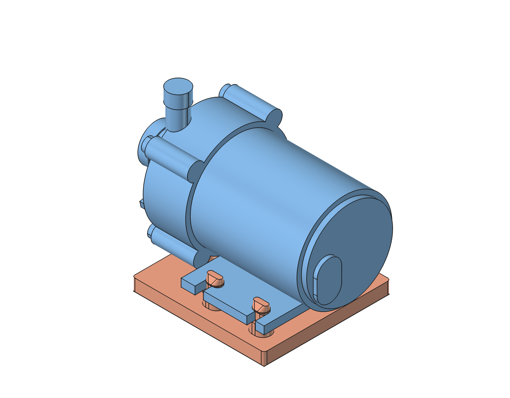
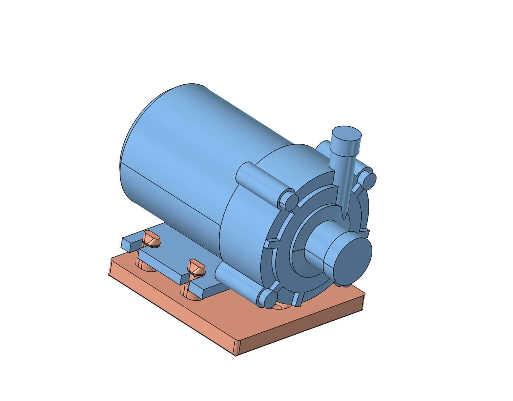
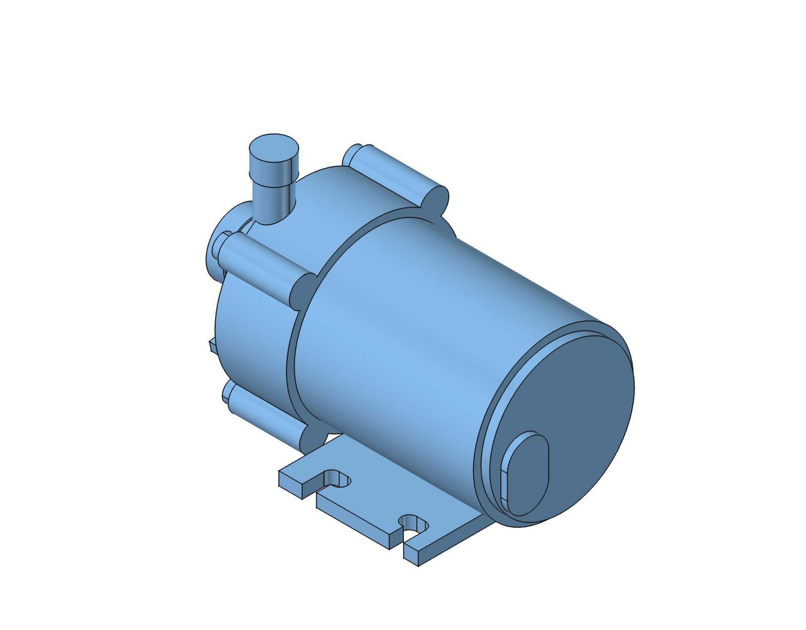
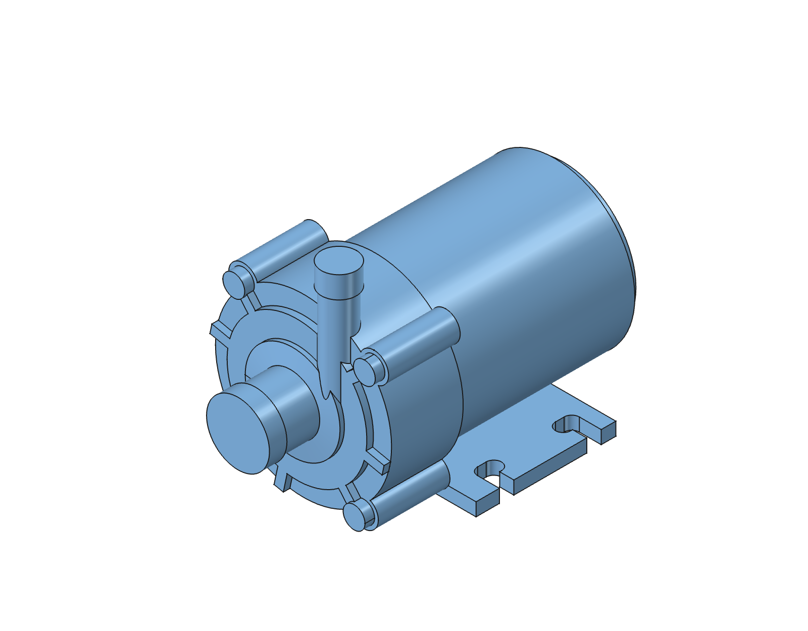
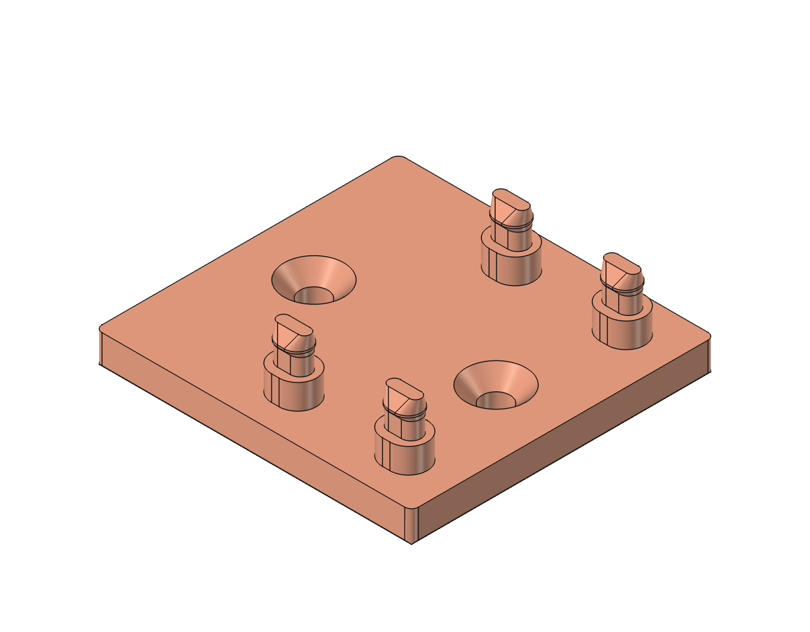
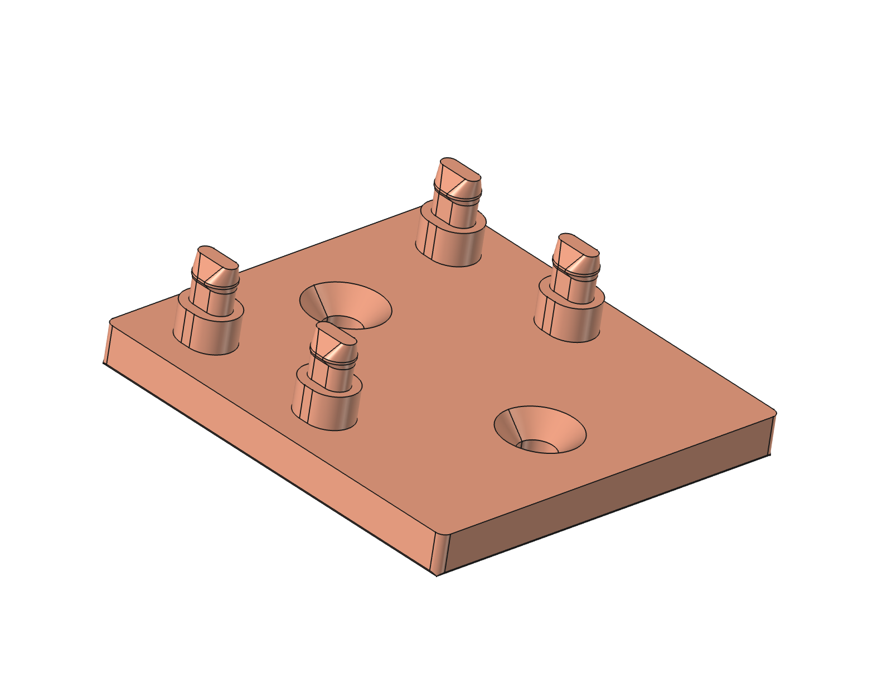

# ROTEK A01VP — pump model and accessories

Parametric reference model of the Rotek WPDC-06.7L-10M-24-VP pump (PUM409)
and accessories designed to fit it. The experimental TPU holder is intended
to reduce vibration transfer; its performance has not yet been measured.

The pump reference model and holder are maintained in this repository for use in both
[JOBO Repair Parts](https://github.com/sasha-nordiclab/jobo-repair-parts) and
[THD CP-Lift Parts](https://github.com/sasha-nordiclab/thd-cp-lift-parts).

 

## Pump

 

| | |
|---|---|
| Product | ROTEK Food Grade Mini Centrifugal Pump with Brushless DC Motor |
| Housing | A01VP |
| Supply | 24 VDC |
| Performance | 6.7 L/min or 10 mWs |
| Model | WPDC-06.7L-10M-24-VP (PUM409) |

## Pump and accessory models

**Working model:** [TPU_Pump_Holder.FCStd](cad/TPU_Pump_Holder.FCStd).

- Body **Rotek_WPDC-06.7L-10M-24-VP** is a reference model of the pump, built from the manufacturer's drawing, photos and caliper measurements. Every size is in the `params` spreadsheet.
- Body **Holder** is the experimental four-post stand (see below).

### Coordinates

- Origin: the centre of the four mount slots, on the mounting face of the plate (z = 0).
- X runs along the pump axis, with the inlet towards −X (inlet tip at x = −49).
- Z points from the mounting face into the pump. The pump axis is at `ax_h` = 21.28 mm (from the drawing, not measured yet).
- In the experimental assembly the pump reference Body is placed 4 mm above its original datum, matching `post_h`; its reference dimensions are unchanged. The stand spans z = −5…9.60 mm.

### Mount plate

- 45 × 32 × 3.0 mm, shifted 1.0 mm towards the inlet from the slot pattern: 5.35 mm from the inlet-end edge to the slots, 3.35 mm from the motor-end edge.
- Four L-shaped bayonet slots: the 3.3 mm entry is open to the side edge, and a 3.5 mm wide hook (5.46 mm along the axis, entry included) turns towards the middle of the plate. Slot pitch 20 × 35 mm.
- Sixteen pockets on the mounting face: the centre column is 2.5 mm deep (a 13 mm web to the motor sits behind it), the rest are 1.5 mm deep.

### Symmetry and rebuild

- One slot corner (entry + hook) is modelled; `slots` (MultiTransform, two mirrors) makes the other three.
- The side and outer pockets are modelled on +Y; `pockets_side_mirror` mirrors them across the XZ plane.
- One ear (lug, screw head, partition to the lug) is modelled; `ears` (PolarPattern ×4) repeats it around the datum line `pump_axis`.
- One face partition is modelled; `face_ribs` (PolarPattern ×4) repeats it, with the copy under the outlet suppressed.
- `python3 scripts/build.py` rebuilds the whole document (pump and holder) from scratch in the running FreeCAD in about 10 s; `build.py N` resumes from step N. The `params` sheet gives every value a description and where it came from.
- Pockets on the mounting face are plain rectangles and L shapes (no corner fillets): the holder only touches the frame and the ribs.
- The measurement sheet (`docs/measurements/`, live page linked there) is regenerated by `scripts/measurements/`: `extract_views.py` in FreeCAD, then `build_page.py` and `write_docs.py`.

### Measurements

- Round 1 (2026-10-07): 45 caliper readings, in `docs/measurements/readings.json` and the table in `docs/measurements/measurements.md`. The model follows them within ±0.1 mm (priority A) and ±0.2 mm (priority B), except the rows below.
- Mounting face to the top of the motor (B10, 39.63 mm in the model) is not measured yet, so `ax_h` still comes from the drawing. The ear angle is derived from `ax_h` and the measured height of the highest ear lug: 40.5° now, against 35° on the drawing. B10 settles both.
- Inlet end: the short cone starts 12 mm from the inlet tip, runs 0.5 mm along the axis from Ø13.4 to Ø21.7, then continues as a cylindrical boss. The outlet tube retains its established axial position. The head length follows photo IMG_7253 (16.4 mm); the caliper reading of 14.0 disagrees and is to be measured again.
- Along the axis, B2 + A2 + B3 is 1.0 mm shorter than the overall length B1. Until B17 and B18 are measured, the plate keeps the drawing position: 32 mm from the inlet tip.

The pump reference Body uses origin XY/YZ sketch supports with parameter-driven attachment offsets. Its polar patterns and slot pattern are native FreeCAD features; the pump-axis datum line remains for the polar patterns. The pocket layouts use equality, alignment and horizontal/vertical constraints; radial ribs use named length, width and angle dimensions. These parameterisation changes preserved the pump shape exactly.

## Holder — four-post experiment

 

A single TPU 95A stand on the bottom of the bath. Its flat floor can be glued down; two M4 holes still allow bolted fixing. Four short columns hold the pump plate 4 mm above the floor. There are no side walls, side lips or entry keys in the final shape.

- Body **Holder** is built by `scripts/build.py`; its dimensions are in the `params` sheet. Its native feature chain is floor Pad, bottom Chamfer, four-corner Fillet, one complete post (column Pad and snap-head AdditiveLoft from five XY-attached, Z-offset sketches) mirrored to four by a single MultiTransform, and a final Hole feature for both M4 countersinks. The obsolete sock features have been removed from the document and build script.
- Floor: 5 mm thick, X = −34…16.9 mm, extended towards the inlet to show the assembly orientation. All four floor corners have a native R1.1 mm Fillet.
- Columns: four oval 7.2 × 6.0 mm posts at X ≈ ±8.92 mm, Y = ±17.5 mm, height `post_h=4` mm. Their top shoulders support the underside of the pump plate.
- Catches: four elongated snap bosses continue above the columns into the hook slots. Stem width 3.2 mm; head width 4.2 mm with a 40° underside and lead-in. Parameter `post_head_pre=0.3 mm` sets a small nominal preload at the plate top. The plate is meant to snap over the heads. Retention against sliding along X without the former keys needs a physical test.
- Mounting holes: two M4 through holes on the floor centreline at X = −23.2 and +6.1 mm, with Ø4.5 mm clearance and 90° Ø9.6 mm countersinks on the pump side.
- Holder bounds: 50.9 × 48.8 × 14.60 mm, z = −5…9.60 mm. The pump and holder are distinct valid solids; their 0.078 mm³ nominal overlap is at the four snap heads.
- Material/profile: AzureFilm TPU, TPU95A Fine, 100 % zig-zag infill. Slicing and snap fit remain untested. A preliminary vibration sensitivity calculation is in [four_post_vibration.md](docs/four_post_vibration.md); actual transmission remains unmeasured.

## Folders

- `cad/` — FreeCAD model.
- `docs/` — notes and calculations.
- `exports/step/` — STEP files of the printed parts.
- `references/` — the manufacturer's drawing and measurement photos.
